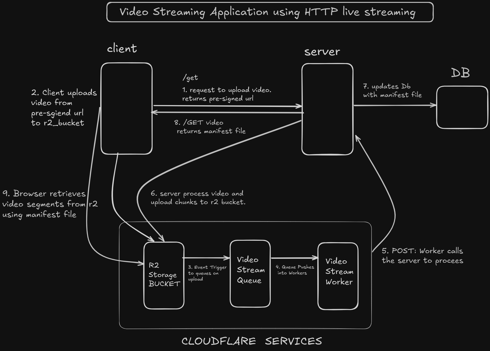

## Video Streaming Server

This is a video streaming backend built using Node.js, Express, and TypeScript.
It processes uploaded videos by transcoding them into multiple resolutions and segmenting them for adaptive bitrate streaming (HLS).
The processed files are stored in a Cloudflare R2 bucket, which is compatible with the AWS S3 API.


### Project Flow

1. The user uploads a video through an authenticated API request.
2. The backend receives the file and uses FFmpeg to transcode it into multiple resolutions (for example, 720p, 480p, 360p).
3. Each resolution is segmented into smaller `.ts` chunks using HLS (HTTP Live Streaming).
4. A `manifest.m3u8` file is generated that lists the segment URLs.
5. All files are uploaded to Cloudflare R2 storage.
6. The manifest can be used by a video player to stream the video adaptively based on network speed.

### Updated Project Flow (v1)

1. The user requests a video upload.
2. The backend generates and returns a pre-signed URL for direct upload.
3. The user directly uploads the video file to Cloudflare R2 using the pre-signed URL.
4. A Cloudflare Worker is triggered when the upload completes, and it notifies the backend.
5. The backend processes the uploaded file using FFmpeg (transcoding + HLS segmentation).
6. Processed files and the manifest are uploaded back to Cloudflare R2.
7. The manifest URL is returned to the client for adaptive playback.
   


### Tech Stack

| Component            | Description                   |
| -------------------- | ----------------------------- |
| **Language**         | TypeScript                    |
| **Framework**        | Express.js (Node.js)          |
| **ORM**              | Prisma                        |
| **Database**         | PostgreSQL                    |
| **Video Processing** | FFmpeg                        |
| **Cloud Storage**    | Cloudflare R2 (S3 compatible) |
| **Authentication**   | JWT-based middleware          |


---

### About HLS, ABR, and FFmpeg

**HLS (HTTP Live Streaming):**
HLS is a streaming protocol that splits video files into smaller segments and provides a manifest file (`.m3u8`) listing those segments. This enables adaptive bitrate streaming.

**Adaptive Bitrate Streaming (ABR):**
ABR allows the video player to automatically switch between different quality levels (resolutions) depending on the user's internet speed.

**FFmpeg:**
FFmpeg is a command-line tool used for video processing. In this project, it transcodes uploaded videos into multiple resolutions and segments them for HLS.

---

### Architecture



---

### Getting Started

To run the server locally:

1. Clone the repository

   ```
   git clone https://github.com/sanjanaynvsdl/videostreaming-api.git
   ```
2. Move into the server directory

   ```
   cd server
   ```
3. Install dependencies

   ```
   npm install
   ```
4. Build the TypeScript project

   ```
   npm run build
   ```
5. Start the server

   ```
   npm start
   ```
Make sure you have FFmpeg installed and your `.env` file configured with database and Cloudflare R2 credentials.


